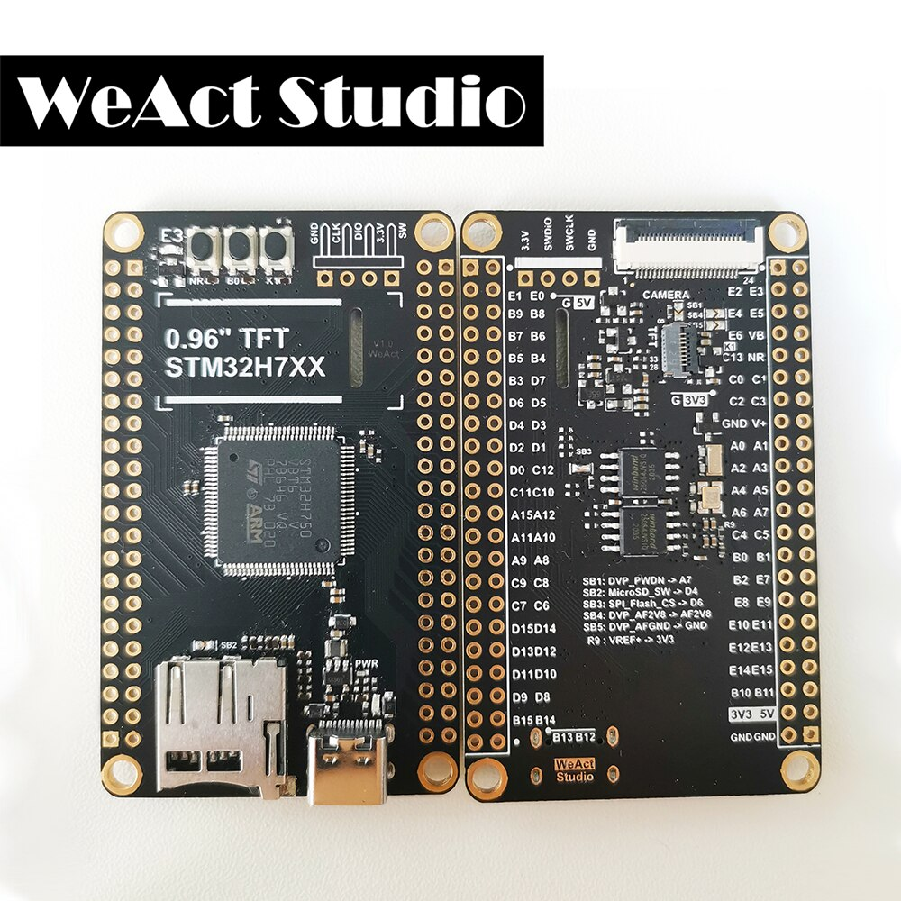

# WeAct STM32H750VBT6



## Supported Features

Features and correct Pin assignments are WIP - I combined them from [mcauser](https://github.com/mcauser/MCUDEV_DEVEBOX_H7XX_M) and [Mythologyli](https://github.com/Mythologyli/MicroPython-MCUDev-DevEBox-STM32H743) and have adjusted for the obvious changes, I will test the other features as I need them. Buses should work too.

So far these things are verified to work:

+ [x] SD Card
+ [x] User LED (LED1, Blue, Pin E3)

## Build the firmware

Clone the board definitions to your [MicroPython](https://github.com/micropython/micropython) `ports/stm32/boards` folder.

```bash
cd micropython/ports/stm32/boards
git clone https://github.com/ikoesters/WEACT_H750VBT6

cd ..
make BOARD=/WEACT_H750VBT6
```

## Flashing via DFU

This board can be flashed using DFU. To put the board in DFU mode, disconnect
USB, press and hold the B0 button and reconnect USB then release B0.
After installing dfu-util, go the the build folder (`ports/stm32/boards/build-WEACT_H750VBT6`) and type:

```bash
dfu-util -a 0 -D firmware.dfu
```

Once the upload is complete, disconnect and reconnect USB.

## Reference

+ [mcauser/MCUDEV_DEVEBOX_H7XX_M](https://github.com/mcauser/MCUDEV_DEVEBOX_H7XX_M)
+ [Mythologyli/MicroPython-MCUDev-DevEBox-STM32H743](https://github.com/Mythologyli/MicroPython-MCUDev-DevEBox-STM32H743)

## License

Licensed under the [MIT License](http://opensource.org/licenses/MIT).
